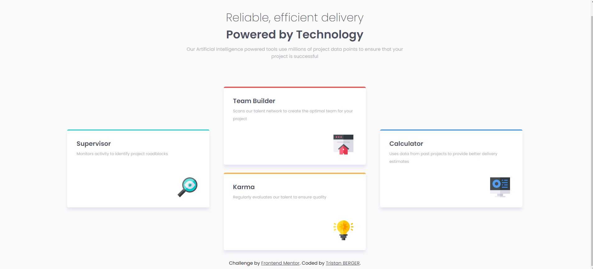

# Frontend Mentor - Four card feature section solution

This is a solution to the [Four card feature section challenge on Frontend Mentor](https://www.frontendmentor.io/challenges/four-card-feature-section-weK1eFYK). Frontend Mentor challenges help you improve your coding skills by building realistic projects. 

## Table of contents

- [Overview](#overview)
  - [The challenge](#the-challenge)
  - [Screenshot](#screenshot)
  - [Links](#links)
- [Author](#author)

## Overview

### The challenge

The challenge is to build a feature section and get it look as close to the design as possible.(Reference image are in ./design)

### Screenshot

Screenshots of the current result.

#### Desktop

### Links

- [Live site URL here](https://tristanberger6.github.io/FM_four_card_feature/)

## Author

- Frontend Mentor - [@TristanBerger6](https://www.frontendmentor.io/profile/TristanBerger6)
